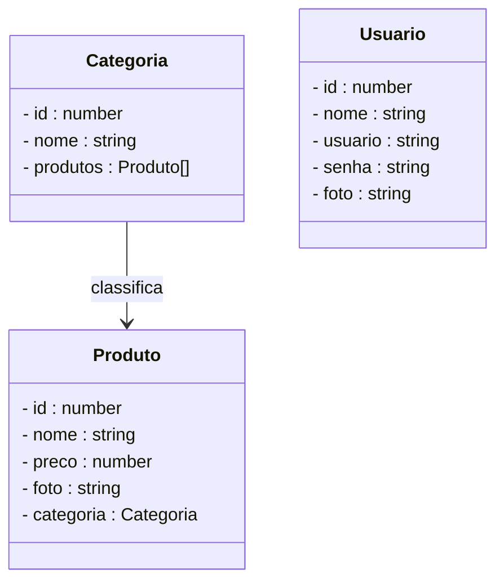
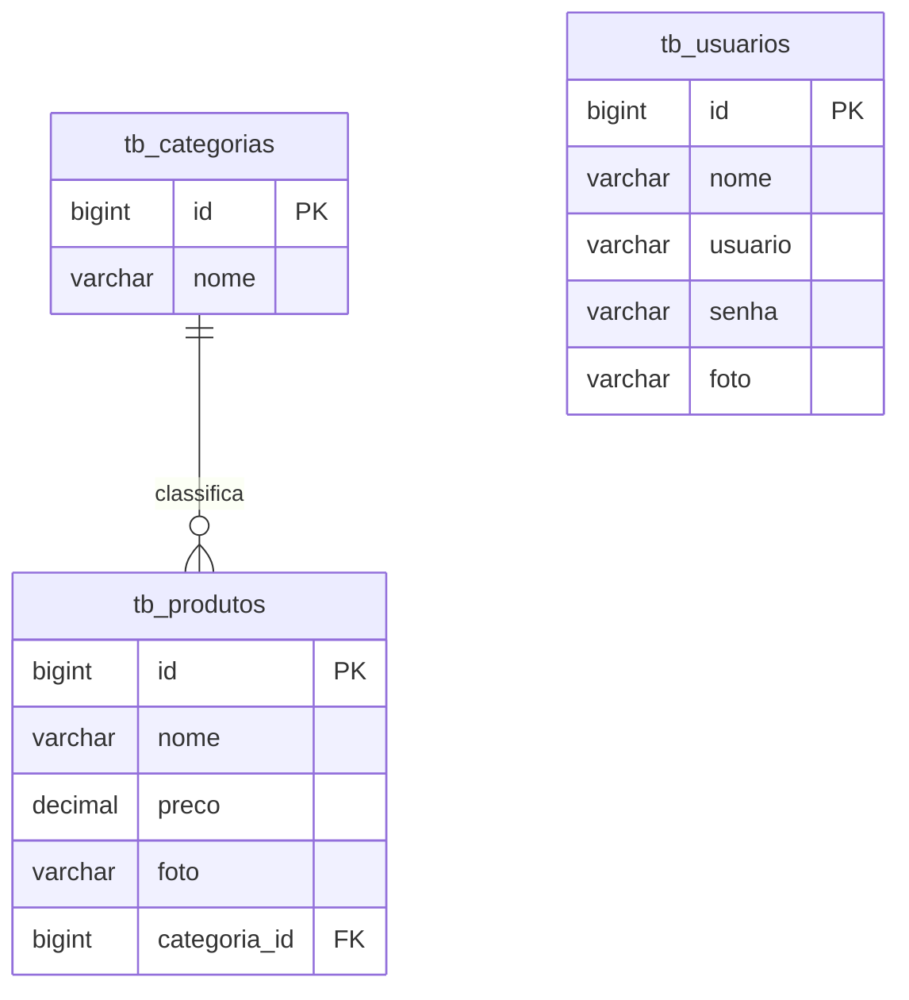

# Projeto Loja de Games - Backend com NestJS

<br />

<div align="center">
    
</div>

<br />

<div align="center">
  
  
  
  
  
  
  
</div>


<br />

## 1. Descrição

A **Loja de Games** é uma aplicação que permite **navegar, cadastrar, atualizar e remover jogos do catálogo da loja**, além de gerenciar **categorias e usuários do sistema**.

Este projeto foi desenvolvido com fins educacionais, simulando o funcionamento de um **sistema de e-commerce de games**, com o objetivo de praticar conceitos de **APIs REST utilizando NestJS e TypeScript**.

Entre os principais recursos de uma loja de games, destacam-se:

1. Cadastro, consulta, edição e remoção de jogos  
2. Classificação dos jogos por categorias específicas  
3. Cadastro e autenticação de usuários  
4. Listagem de jogos por categoria  
5. Controle de acesso e segurança nas operações sensíveis  

<br />

## 2. Sobre esta API

A API da **Loja de Games** foi desenvolvida utilizando **TypeScript** e o **framework NestJS**, seguindo princípios de **Arquitetura em Camadas, Injeção de Dependência e APIs REST**.

A aplicação fornece endpoints para gerenciamento dos recursos **Usuário**, **Produto** e **Categoria**, permitindo a interação entre aplicações clientes e o catálogo de jogos disponíveis na plataforma.

<br />

### 2.1. Principais funcionalidades da API:

1. Consulta, cadastro, login e atualização dos dados dos usuários  
2. Consulta, criação e gerenciamento de categorias para organizar os jogos  
3. Cadastro, edição, listagem e exclusão de jogos  
4. Associação de jogos a categorias  
5. Autenticação via **JWT** para segurança nas requisições  

<br />

## 3. Diagrama de Classes

O **Diagrama de Classes** representa a estrutura do sistema, mostrando classes, atributos, métodos e os relacionamentos entre as entidades principais: **Produto**, **Categoria** e **Usuário**.



## 4. Diagrama Entidade-Relacionamento (DER)

O **DER** representa como os dados estão organizados no banco de dados relacional, incluindo tabelas e relacionamentos.



## 5. Tecnologias utilizadas

| Item                          | Descrição  |
| ----------------------------- | ---------- |
| **Runtime**                   | Node.js    |
| **Linguagem de programação**  | TypeScript |
| **Framework**                 | NestJS     |
| **ORM**                       | TypeORM    |
| **Banco de dados Relacional** | MySQL      |
| **Segurança**                 | Passport   |
| **Autenticação**              | JWT        |
| **Testes automatizados**      | Jest       |
| **Documentação**              | Swagger    |

## 6. Requisitos

Para executar o projeto localmente, você precisará ter instalado:

- [Node.js](https://nodejs.org/) (versão 18 ou superior)
- [MySQL](https://dev.mysql.com/downloads/)
- [Visual Studio Code](https://code.visualstudio.com/)
- [Insomnia](https://insomnia.rest/download)
- [Nest CLI](https://docs.nestjs.com/cli/overview)

Instalação do Nest CLI:

```bash
npm install -g @nestjs/cli
```

## 7. Como Executar o projeto

### 7.1. Clonando o Repositório

Clone o repositório do projeto:

```bash
git clone https://github.com/rafaelq80/lojagames_nest.git
```

Entre na pasta do projeto:

```bash
cd lojagames_nest
```

### 7.2. Instalando as dependências

Execute o comando abaixo para instalar as dependências do projeto:

```bash
npm install
```

### 7.3. Executando a aplicação

Para iniciar a aplicação em modo de desenvolvimento:

```bash
npm run start:dev
```

A aplicação será iniciada no endereço:

```
http://localhost:3000
```

> [!TIP]
>
> Ao acessar a URL `http://localhost:3000/api` no navegador, a interface do **Swagger** será exibida automaticamente, permitindo visualizar e testar os endpoints da API.


## 8. Executando os Testes

O projeto utiliza **Jest** para execução de testes automatizados.

Para executar os testes:

```bash
npm run test
```

Para executar os testes e2e:

```bash
npm run test:e2e
```

Os resultados serão exibidos no terminal após a execução.

## 9. Implementações Futuras

-  Consulta de produtos pelo maior e menor preço
-  Segurança completa da aplicação
-  Ampliação da cobertura de testes
-  Deploy da aplicação

## 10. Contribuição

Este repositório faz parte de um projeto educacional, mas contribuições são bem-vindas. Caso tenha sugestões, correções ou melhorias, você pode:

- Criar uma **Issue**
- Enviar um **Pull Request**
- Compartilhar com outros desenvolvedores que estejam aprendendo **NestJS** e **APIs REST**

## 11. Contato

Desenvolvido por **Rafael**

Para dúvidas, sugestões ou colaborações, entre em contato via **GitHub** ou abra uma **issue** no repositório.